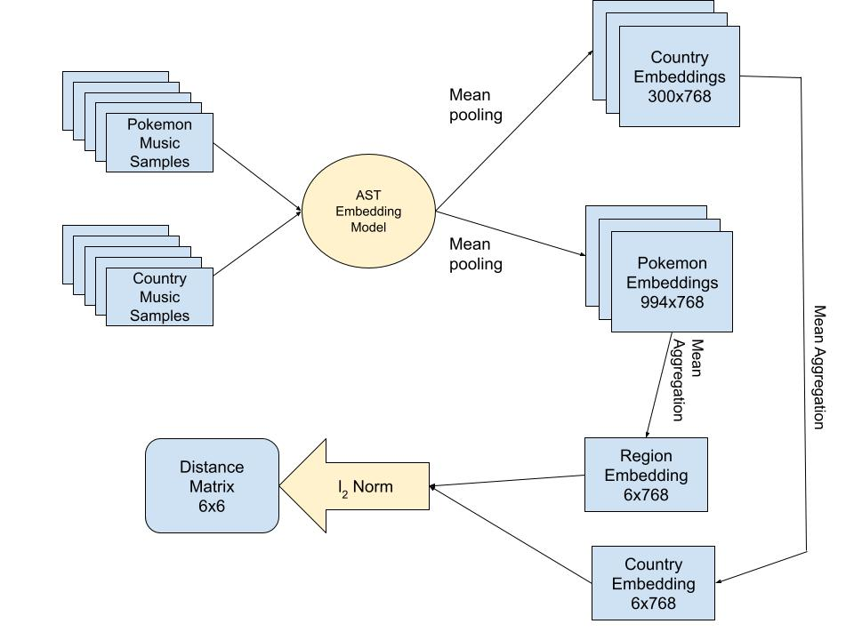

# DataHacks25 Project: Embedding Pokémon OSTs into the Real World

## Theme: Popular Culture  
For this year's DataHacks theme of Popular Culture, we explored the cultural and stylistic composition of music from the Pokémon game series.

## Goal  
Our objective was to determine how the soundtracks from each Pokémon region (e.g., Unova, Johto, Galar) musically relate to real-world cultures.  
Do Kalos tracks sound like France? Is Alola sonically close to Hawaii?  
We used deep audio embeddings to find out.

## Approach  
We used the Audio Spectrogram Transformer (AST) — a model trained on large-scale audio datasets — to embed soundtrack clips from both Pokémon regions and real-world country samples into a shared high-dimensional space.

### Process Overview:

1. **Audio Collection**  
   - Pokémon OSTs: Extracted from various game regions  
   - Real-world music samples: Curated by country (e.g., Japan, UK, France)

2. **Audio Embedding**  
   - Passed all audio through the [AST Model](https://huggingface.co/MIT/ast-finetuned-audioset-10-10-0.4593)  
   - Used mean pooling over the time dimension to create 768-dimensional embeddings

3. **Aggregation**  
   - Averaged track embeddings by Pokémon region and country  
   - Resulted in 6×768 matrices for both regions and countries

4. **Similarity Calculation**  
   - Computed pairwise L2 distances between region and country embeddings  
   - Generated a 6×6 distance matrix representing musical proximity

## Dataset  
You can access our audio dataset here: [Google Drive Link](https://drive.google.com/drive/folders/1pLK22UMmumJhxEQrM3GIX7nnM0j5KPew?usp=sharing)

- Pokémon OSTs grouped by game region  
- Real-world cultural tracks grouped by country

## Notebook  
Run the full notebook on Google Colab: [Open in Colab](https://colab.research.google.com/drive/1EgGUgF4dFQEHhzJy02_lGMBuWHIbU7QN?usp=sharing)

## Tech Stack
- Python, PyTorch, Librosa, Pandas  
- HuggingFace Transformers (`ASTModel`)  
- Seaborn and Matplotlib for visualization  

## Team
- Arnav Gurha  
- Ben Mendoza  
- Teo Imoto-Tar  
- Project for DataHacks25
